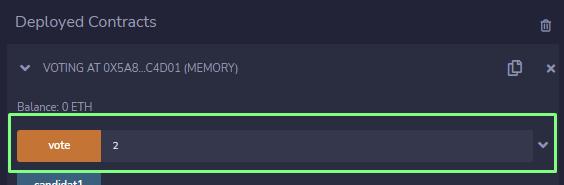
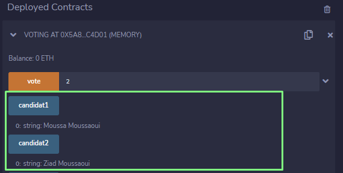
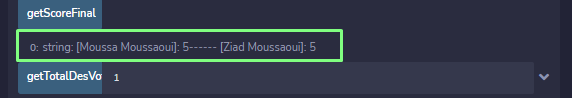
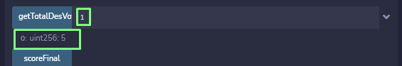

# SMART CONTRACT
**Made By : [MOUSSA MOUSSAOUI](https://www.linkedin.com/in/cryptpi/)**

**Guidelines :**

- Import the project files into  [REMIX IDE ONLINE EDITOR](https://remix.ethereum.org/)
- Compile the Smart Contract using the Compile button
- Deploy it
- Then you have an interactive interface to test the functionnalities specified in the smart contract
    - Specify the candidat number to vote for the candidat(X).
    
    - Use Buttons **( candidat1, candidat2 )** to see candidat names.
    
    - Use **getScoreFinal** Button to get the final vote scores.
    
    - Use **getTotalDesVotes** Button to get the number of votes for a specific candidat.
    
